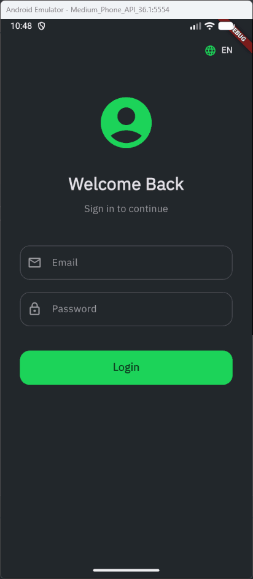
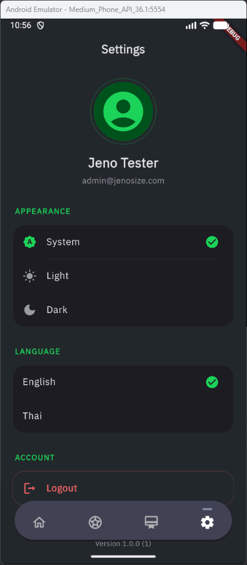
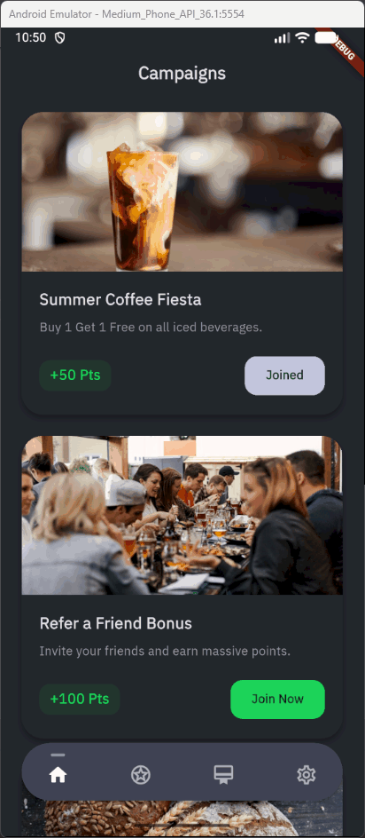
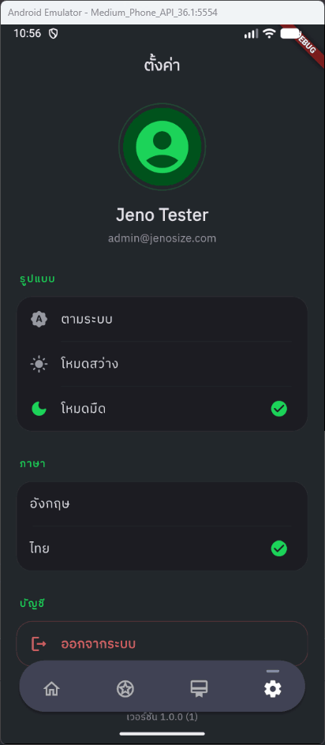

# Jenosize Assignment

## 📺 Demonstration

Here are some previews of the core features, demonstrating clean state management, responsiveness, and UI/UX polish.

|                 **User Authentication**                  |                    **Campaign Interactions**                     |                **Settings & Localization**                 |
| :------------------------------------------------------: | :--------------------------------------------------------------: | :--------------------------------------------------------: |
|  |  |  |
|              _Secure Login & Session Sync_               |                  _Browsing & Joining Campaigns_                  |                 _Theme & Language Toggle_                  |

<br>

|                   **Joined Status Updates**                    |                 **Logout & Session Clear**                 |
| :------------------------------------------------------------: | :--------------------------------------------------------: |
|  |  |
|               _Instant UI Feedback (Bloc State)_               |             _Secure routing & state clearing_              |

---

## Run and Debug

Can choose the flavor directly from **VSCode**.


## Build

Run Build Task (⇧⌘B)

Can choose the flavor directly from **VSCode**.


## Project Structure

This project follows a Clean Architecture structure:

```
lib
├── app                 # App configuration, DI
│   ├── initializers
│   ├── router
│   ├── env.dart
│   └── flavor.dart
├── common              # Common utilities and global helpers
├── data                # Data layer: API, models, repositories impl, sources
│   ├── api
│   ├── data_sources
│   ├── enums
│   ├── models
│   ├── repositories
│   └── storages
├── domain              # Domain layer: Entities, repository interfaces, use-cases
│   ├── core
│   ├── repositories
│   ├── storages
│   └── use_cases
├── generated           # Generated codes (assets, l10n)
├── ui                  # Presentation layer
│   ├── cubits
│   ├── extensions
│   ├── global_widgets
│   ├── screens
│   ├── styles
│   └── utils
└── main.dart           # Entry point
```

### 🌍 Localization Management (Scalable Workflow)

1. **Centralized Management:** All translation keys and values are managed in a shared Google Sheet:
   👉 **[Jenosize Localization Master Sheet](https://docs.google.com/spreadsheets/d/1IQyoNxRXKjmASvWeUvDttLxxLyrIdyvx7rIp8S-8smc/edit?gid=374154010#gid=374154010)**

2. **Update Language Files:**
   Once translations are updated in the sheet, simply copy the generated JSON format from the sheet and paste it into the respective `.arb` files located in the `assets/localizations/` directory.

   ```path
   assets/
     localizations/
       app_en.arb
       app_th.arb
   ```

   > Keys should be separated by pages so they are easy to find. And it's also easy to fix.

3. **Compile to Dart Codes:**
   Run the Build Task (⇧⌘B) and select `Flutter: flutter gen-l10n` to update the localization classes across the app.

   > Note: This workflow ensures that the UI always reflects the latest business requirements while minimizing merge conflicts in the language files.

### Add Assets Images

1. Add image files in the `assets/images` folder.

   ```path
   assets/
     images/
       example.png
   ```

2. Run Build Task

   (⇧⌘B) and Select `Flutter: flutter pub run build_runner build`

3. Use Images

   ```dart
   import '/generated/assets.gen.dart';

   ...
    Assets.images.example.image(),
   ...
   ```

## 🧪 Testing Strategy

A major focus of this project is **Automated Testing**, ensuring the app is production-ready and compatible with CI/CD pipelines:

### 1. Unit Testing Examples

- **Data Layer**: - AuthRemoteDataSourceTest: Mocks AssetBundle for JSON serialization.
  - **CampaignRepositoryImplTest, UserRepositoryImplTest**: Validates data mapping and error handling.

  - **Models**: (AuthTest, UserTest, LoginWithEmailRequestTest).

- **Domain Layer**: - SplashScreenUseCaseTest: Business logic validation.
  - **AppErrorTest**: Core error handling result pattern.

- **Presentation Layer (Cubits & States)**: - Core states: SessionCubitTest, AppLanguageCubitTest, ThemeModeCubitTest.
  - **Feature states**: LoginScreenCubitTest, HomeScreenCubitTest, MainScreenCubitTest.

### 2. Widget Testing Examples

Demonstrates advanced mocking of complex contexts (Localization, Theme Extensions, Blocs):

LoginScreenTest: Validates form interactions, email format validation, and UI state responses.

- **Cubits**: Validates all state transitions (Initial, Loading, Ready, Failure) for features like Home and Session management.
- **Repositories**: Tests data handling logic, ensuring proper mapping of success and failure cases from the Data Source.
- **Result Pattern**: Ensures robust error handling via `AppError` throughout the domain layer.

  <br>

## 🚀 CI/CD Integration Plan (Real-world Scenario)

To ensure high code quality and streamline the release process for a scaling team, this project is structured to be easily integrated into a CI/CD pipeline (e.g., GitHub Actions, Codemagic, or Bitrise). A standard pipeline would include the following automated stages:

- **Code Quality & Static Analysis (flutter analyze):**
  - Automatically checks for formatting, syntax errors, and strict linting rules on every Pull Request. This enforces a unified codebase standard across the engineering team before any code is merged.

- **Automated Testing (flutter test):**
  - Executes the comprehensive Unit and Widget test suite. If any test fails, the pipeline blocks the merge, ensuring no breaking changes reach the main branch.

- **Continuous Delivery (Firebase App Distribution):**
  - Automatically builds and distributes the APK/IPA to QA teams and stakeholders via Firebase. This creates a fast feedback loop during the Sprint without manual build sharing.

- **Continuous Deployment (App Store & Google Play):**
  - Integrates with Fastlane to automate the final release process, securely managing signing certificates and pushing production-ready builds directly to the stores.

  <br>

## 📈 Scalability & Robustness

- **Scalability**: Implemented Theme Extensions and Localization to support new themes and languages instantly.
- **Robustness**: Enforced strict null-safety and used Equatable for efficient object comparison and performance optimization.

<br>

## 💡 Developer Reflections & Notes

As a final note, I would like to share a few design decisions and reflections made during the development of this assignment:

1. **State Management Choice (Cubit/Bloc):** I opted for `Cubit` over other state management solutions because of its strict separation of business logic from the UI. It provides predictable state transitions, which makes writing robust Unit Tests significantly easier, a critical factor for a scaling team.

2. **Mocking Strategy vs. Real API:**
   Since a real backend wasn't required, I simulated API calls using `AssetBundle` to load local JSON files along with a `Future.delayed`. This approach allowed me to showcase proper Loading and Error states in the UI just as it would behave in a production environment.

3. **Dependency Injection for Testing:**
   Instead of tightly coupling the `rootBundle` to the Data Sources, I injected the `AssetBundle`. This allowed me to easily mock the file system during Unit Testing, ensuring the tests run purely in-memory, fast, and completely flaky-free.

4. **Looking Ahead: What I'd Love to Build at Jenosize**
   If given the opportunity to join the Jenosize team, here is how I plan to evolve and scale this application further:
   - **Offline-First Capabilities:** Implement robust local caching (using `Hive` or `Isar`) to ensure the loyalty platform remains fast and accessible for SME users even in low-connectivity areas.
   - **Seamless Referral Tracking:** Integrate Firebase Dynamic Links (or Universal Links) to automatically capture and process referral codes when a new user installs the app via a shared link, maximizing user acquisition.
   - **AI-Driven Personalization:** Leverage the company's AI initiatives to build a recommendation engine that suggests targeted campaigns to users based on their point history and engagement behavior.
   - **Premium Micro-Interactions:** Elevate the overall UX with advanced Hero animations and seamless state transitions, ensuring the mobile experience meets the high standards of Jenosize's product ecosystem.
