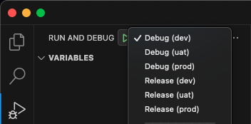
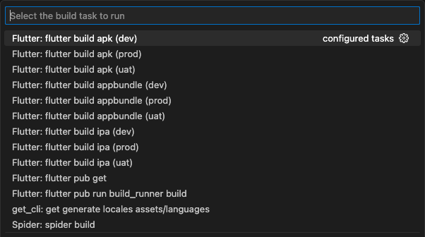

# App Template Flutter

## Run and Debug

Can choose the flavor directly from **VSCode**.



## Build

Run Build Task (⇧⌘B)

Can choose the flavor directly from **VSCode**.



## Project Structure

This project follows a Clean Architecture structure:

```
lib
├── app                 # App configuration, DI
│   ├── initializers
│   ├── router
│   ├── env.dart
│   └── flavor.dart
├── common              # Common utilities and global helpers
├── data                # Data layer: API, models, repositories impl, sources
│   ├── api
│   ├── data_sources
│   ├── enums
│   ├── models
│   ├── repositories
│   └── storages
├── domain              # Domain layer: Entities, repository interfaces, use-cases
│   ├── core
│   ├── repositories
│   ├── storages
│   └── use_cases
├── generated           # Generated codes (assets, l10n)
├── ui                  # Presentation layer
│   ├── cubits
│   ├── extensions
│   ├── global_widgets
│   ├── screens
│   ├── styles
│   └── utils
└── main.dart           # Entry point
```

## Contribute

Too lazy to create screen? Please visit https://knottx.dev/flutter_bloc_cubit_create/

### Add Localizations

1. Add new key and value to JSON language files in the `assets/localizations` folder.

   ```path
   assets/
     localizations/
       app_en.arb
       app_th.arb
   ```

   > Keys should be separated by pages so they are easy to find. And it's also easy to fix.

2. Run Build Task

   (⇧⌘B) and Select `Flutter: flutter gen-l10n`

### Add Assets Images

1. Add image files in the `assets/images` folder.

   ```path
   assets/
     images/
       example.png
   ```

2. Run Build Task

   (⇧⌘B) and Select `Flutter: flutter pub run build_runner build`

3. Use Images

   ```dart
   import '/generated/assets.gen.dart';

   ...
    Assets.images.example.image(),
   ...
   ```
